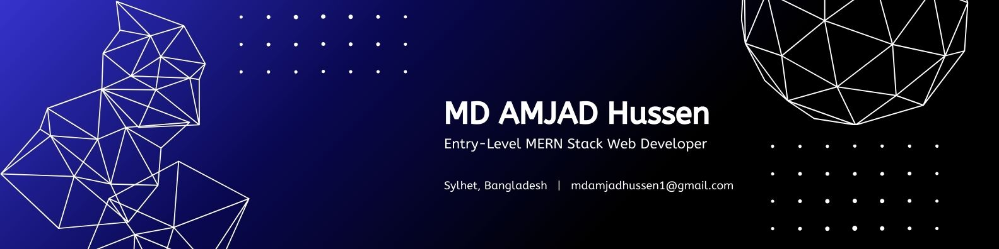

I am an entry-level MERN Stack Web Developer with hands-on experience in building responsive web applications using MongoDB, Express.js, React, and Node.js. I enjoy creating clean, efficient, and user-friendly web solutions while continuously improving my skills.

- 🔭 I’m currently working on building full-stack web applications using the MERN stack.
- 🌱 I’m currently learning advanced React, backend optimization, and secure web development practices.
- 👯 I’m looking to collaborate on web development projects and open-source initiatives.
- 🤔 I’m looking for help with improving application scalability and performance.
- 💬 Ask me about MERN stack development, frontend UI design, and basic web security.
- 📫 How to reach me: You can contact me via GitHub or LinkedIn.
- 😄 Pronouns: He/Him
- ⚡ Fun fact: I enjoy combining web development with cybersecurity knowledge.

## 🌐 Socials:
  

# 💻 Tech Stack:
                    
# 📊 GitHub Stats:
 
 

## 🏆 GitHub Trophies

### ✍️ Random Dev Quote

### 🔝 Top Contributed Repo

---

<!-- Proudly created with GPRM ( https://gprm.itsvg.in ) -->
